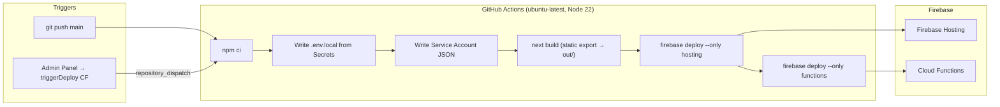
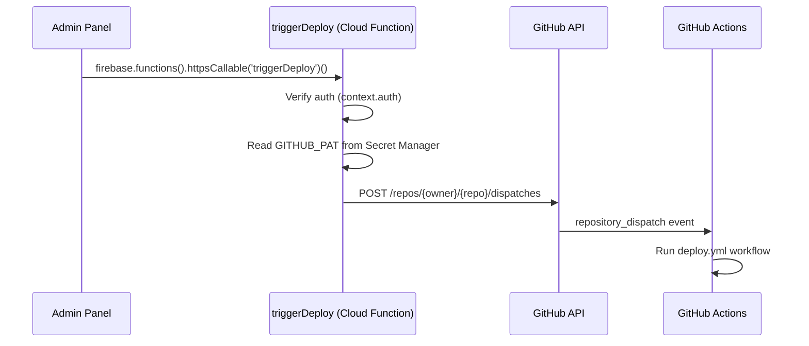

# Deployment Blueprint

> Exact replication guide for the CI/CD and automation architecture of the **somanatha-shop** reference project.

---

## 1. Architecture At a Glance



| Component | Details |
|---|---|
| **Hosting** | Static export (`out/` directory), Firebase Hosting |
| **Functions** | Node 22, separate `npm ci` in `functions/` |
| **Build** | `next build` with `output: 'export'`, `trailingSlash: true`, `images.unoptimized: true` |
| **Triggers** | Push to `main` + `repository_dispatch` event type `trigger-deploy` |

---

## 2. Workflow Dissection — `deploy.yml`

Source: [deploy.yml](file:///d:/somanatha-shop/.github/workflows/deploy.yml)

### 2.1 Triggers

```yaml
on:
  push:
    branches: [main]        # Every push to main
  repository_dispatch:
    types: [trigger-deploy]  # From admin panel button
```

The `repository_dispatch` is fired by the `triggerDeploy` Cloud Function, which calls the GitHub API:

```
POST https://api.github.com/repos/{owner}/{repo}/dispatches
{
  "event_type": "trigger-deploy",
  "client_payload": { "triggered_by": "user@email.com", "timestamp": "..." }
}
```

### 2.2 Build Steps (in order)

| # | Step | Command | Notes |
|---|---|---|---|
| 1 | Checkout | `actions/checkout@v4` | |
| 2 | Node.js | `actions/setup-node@v4` with `node-version: "22"`, `cache: npm` | |
| 3 | Install deps | `npm ci` | Root project only |
| 4 | Write `.env.local` | `env \| grep -E '^(NEXT_PUBLIC_\|TELEGRAM_\|SMTP_\|EMAIL_)' > .env.local` | From GitHub Secrets → env vars → file |
| 5 | Write SA key | `echo "$FIREBASE_SA" > /tmp/firebase-sa.json` | From `FIREBASE_SERVICE_ACCOUNT` secret |
| 6 | Build | `npm run build` | `GOOGLE_APPLICATION_CREDENTIALS=/tmp/firebase-sa.json` — needed for server-side Firestore reads at build time |
| 7 | Deploy Hosting | `npx firebase-tools deploy --only hosting --project {project-id}` | Uses SA key for auth |
| 8 | Deploy Functions | `cd functions && npm ci && npx firebase-tools deploy --only functions` | **`continue-on-error: true`** — won't fail the workflow |
| 9 | Cleanup | `rm -f /tmp/firebase-sa.json` | `if: always()` — runs even on failure |

> [!IMPORTANT]
> Step 6 uses `GOOGLE_APPLICATION_CREDENTIALS` because the Next.js build (`output: 'export'`) runs Server Components that fetch data from Firestore via the Firebase Admin SDK at build time.

---

## 3. Secrets & Authentication

### 3.1 GitHub Repository Secrets

These must be set via **GitHub → Repo → Settings → Secrets and variables → Actions**:

| Secret Name | Purpose | Where Used |
|---|---|---|
| `NEXT_PUBLIC_FIREBASE_API_KEY` | Firebase client SDK | `.env.local` (build) |
| `NEXT_PUBLIC_FIREBASE_AUTH_DOMAIN` | Firebase Auth domain | `.env.local` (build) |
| `NEXT_PUBLIC_FIREBASE_PROJECT_ID` | Firebase project ID | `.env.local` (build) |
| `NEXT_PUBLIC_FIREBASE_STORAGE_BUCKET` | Storage bucket URL | `.env.local` (build) |
| `NEXT_PUBLIC_FIREBASE_MESSAGING_SENDER_ID` | FCM sender ID | `.env.local` (build) |
| `NEXT_PUBLIC_FIREBASE_APP_ID` | Firebase app ID | `.env.local` (build) |
| `NEXT_PUBLIC_FIREBASE_MEASUREMENT_ID` | Analytics ID | `.env.local` (build) |
| `TELEGRAM_BOT_TOKEN` | Telegram Bot API token | `.env.local` (build) |
| `TELEGRAM_CHAT_ID` | Telegram chat for notifications | `.env.local` (build) |
| `SMTP_HOST` | SMTP server hostname | `.env.local` (build) |
| `SMTP_PORT` | SMTP port (465 for SSL) | `.env.local` (build) |
| `SMTP_USER` | SMTP username | `.env.local` (build) |
| `SMTP_PASS` | SMTP password / app password | `.env.local` (build) |
| `EMAIL_FROM` | Sender email address | `.env.local` (build) |
| `EMAIL_TO` | Recipient email for notifications | `.env.local` (build) |
| `FIREBASE_SERVICE_ACCOUNT` | Full service account JSON (not base64) | Written to `/tmp/firebase-sa.json` |

**Total: 16 secrets**

### 3.2 Firebase Cloud Functions Secrets

These are managed via the **Firebase Secrets Manager** (Google Cloud Secret Manager under the hood), separate from GitHub Secrets:

| Secret | Set via | Accessed in Code |
|---|---|---|
| `GITHUB_PAT` | `firebase functions:secrets:set GITHUB_PAT` | `process.env.GITHUB_PAT` in `triggerDeploy` function |

The function declares its secret dependency in code:

```javascript
exports.triggerDeploy = functions
    .runWith({ secrets: ['GITHUB_PAT'] })
    .https.onCall(async (data, context) => { ... });
```

> [!NOTE]
> Firebase secrets are **not** the same as GitHub secrets. They are stored in GCP Secret Manager and injected only into the specific function that declares them.

### 3.3 Cloud Functions Environment Variables

Stored in `functions/.env` (committed to the repo, **not** gitignored):

| Variable | Purpose |
|---|---|
| `TELEGRAM_BOT_TOKEN` | Telegram Bot API |
| `TELEGRAM_CHAT_ID` | Notification target chat |
| `SMTP_HOST` | Email server |
| `SMTP_PORT` | Email port |
| `SMTP_USER` | Email username |
| `SMTP_PASS` | Email password |
| `EMAIL_FROM` | Sender address |
| `EMAIL_TO` | Admin recipient |
| `YOOKASSA_SHOP_ID` | Payment gateway ID |
| `YOOKASSA_SECRET_KEY` | Payment gateway key |

> [!CAUTION]
> In the reference project, `functions/.env` contains **production secrets** and is committed to the repo. For a new project, strongly consider adding `functions/.env` to `.gitignore` and using `firebase functions:config:set` or Firebase Secrets Manager instead.

---

## 4. Environment File Structures

### 4.1 Root `.env.local` (Next.js client)

Template: [.env.local.example](file:///d:/somanatha-shop/.env.local.example)

```env
# Firebase Configuration (NEXT_PUBLIC_ prefix = available in browser)
NEXT_PUBLIC_FIREBASE_API_KEY=...
NEXT_PUBLIC_FIREBASE_AUTH_DOMAIN=your-project.firebaseapp.com
NEXT_PUBLIC_FIREBASE_PROJECT_ID=your-project-id
NEXT_PUBLIC_FIREBASE_STORAGE_BUCKET=your-project.appspot.com
NEXT_PUBLIC_FIREBASE_MESSAGING_SENDER_ID=...
NEXT_PUBLIC_FIREBASE_APP_ID=...

# Telegram Bot (used only at build time, not shipped to browser)
TELEGRAM_BOT_TOKEN=...
TELEGRAM_CHAT_ID=...
```

- **Local dev:** Created manually from `.env.local.example`
- **CI/CD:** Auto-generated in step 4 from GitHub Secrets via `env | grep`
- **Gitignored:** Yes (`.env.local` is in `.gitignore`)

### 4.2 `functions/.env` (Cloud Functions runtime)

```env
TELEGRAM_BOT_TOKEN=...
TELEGRAM_CHAT_ID=...
SMTP_HOST=smtp.gmail.com
SMTP_PORT=465
SMTP_USER=...
SMTP_PASS=...
EMAIL_FROM=...
EMAIL_TO=...
YOOKASSA_SHOP_ID=...
YOOKASSA_SECRET_KEY=...
```

- **Runtime:** Loaded automatically by Firebase Functions runtime (Node 22)
- **Deployed with:** `firebase deploy --only functions` includes this file
- **Gitignored:** Currently **no** (should be)

### 4.3 `.firebaserc` (project alias)

```json
{
  "projects": {
    "default": "your-new-project-id"
  }
}
```

### 4.4 `next.config.mjs` (build config)

```javascript
const nextConfig = {
    output: 'export',       // Static HTML export (no Node server)
    trailingSlash: true,     // /page/ instead of /page
    images: {
        unoptimized: true,   // No Next.js image optimization (Firebase Storage serves images)
    },
};
```

---

## 5. Step-by-Step Setup Guide for a New Project

### Phase 1: Firebase Setup

1. **Create Firebase project** at [console.firebase.google.com](https://console.firebase.google.com)
2. **Enable services:**
   - Authentication → Email/Password sign-in
   - Cloud Firestore → Create database (production mode)
   - Storage → Create default bucket
   - Hosting → Set up
   - Functions → Enable (requires Blaze plan)
3. **Register a Web App** in Project Settings → copy the config values
4. **Create a service account key:**
   - Project Settings → Service accounts → Generate new private key
   - Save the JSON file locally (you'll need its contents for GitHub Secrets)
5. **Deploy security rules locally:**
   ```bash
   firebase login
   firebase use --add   # Select your project, alias "default"
   firebase deploy --only firestore:rules,storage
   ```
6. **Deploy Firestore indexes:**
   ```bash
   firebase deploy --only firestore:indexes
   ```

### Phase 2: Cloud Functions Secrets

```bash
# Set the GitHub PAT for admin-triggered deploys
firebase functions:secrets:set GITHUB_PAT
# Paste your GitHub Personal Access Token (needs 'repo' scope)
```

### Phase 3: GitHub Repository Setup

1. **Create repo** and push your code
2. **Add all 16 secrets** via Settings → Secrets → Actions:
   - The 7 `NEXT_PUBLIC_FIREBASE_*` values (from step 3 above)
   - `TELEGRAM_BOT_TOKEN`, `TELEGRAM_CHAT_ID`
   - `SMTP_HOST`, `SMTP_PORT`, `SMTP_USER`, `SMTP_PASS`, `EMAIL_FROM`, `EMAIL_TO`
   - `FIREBASE_SERVICE_ACCOUNT` — paste the **entire JSON contents** of your service account key

   > **Shortcut:** Use the provided [upload-secrets.ps1](file:///d:/somanatha-shop/scripts/upload-secrets.ps1) script (requires `gh` CLI):
   > ```powershell
   > # Upload all .env.local vars as GitHub Secrets
   > .\scripts\upload-secrets.ps1
   >
   > # Then upload the service account separately
   > $sa = Get-Content path\to\serviceAccountKey.json -Raw
   > $sa | gh secret set FIREBASE_SERVICE_ACCOUNT --repo "owner/repo"
   > ```

3. **Create `functions/.env`** with your notification and payment credentials
4. **Update `.firebaserc`** to point to your new project ID
5. **Update `firebase.json`** — replace the project name in any hardcoded paths
6. **Update `src/lib/config.ts`** — replace the fallback API base URL:
   ```typescript
   const API_BASE_URL =
       process.env.NEXT_PUBLIC_API_BASE_URL ||
       'https://us-central1-YOUR-PROJECT-ID.cloudfunctions.net';
   ```
7. **Update `functions/index.js`** — replace the GitHub repo path in `triggerDeploy`:
   ```javascript
   'https://api.github.com/repos/YOUR-ORG/YOUR-REPO/dispatches'
   ```

### Phase 4: First Deploy

```bash
# Local test
npm run dev

# First manual deploy (before GitHub Actions takes over)
npm run build
firebase deploy --only hosting
cd functions && npm ci && firebase deploy --only functions
```

After this, every push to `main` will trigger the full automated pipeline.

---

## 6. Admin-Triggered Deploy Mechanism



**Requirements for this to work:**
1. `GITHUB_PAT` set as Firebase secret (not GitHub secret)
2. The PAT must have `repo` scope
3. The admin user must be authenticated via Firebase Auth
4. The repo path in the function must match exactly

---

## 7. Quick Reference — Files to Modify for a New Project

| File | What to Change |
|---|---|
| `.firebaserc` | `"default": "new-project-id"` |
| `firebase.json` | Project-specific hosting config if needed |
| `next.config.mjs` | Usually no changes needed |
| `src/lib/config.ts` | Fallback API base URL |
| `src/lib/firebase-admin.ts` | `projectId` fallback value |
| `functions/index.js` | GitHub repo URL in `triggerDeploy`, YooKassa return URL |
| `functions/.env` | All notification and payment credentials |
| `.env.local` | All Firebase client config values |
| `scripts/upload-secrets.ps1` | `--repo` parameter |
| `.github/workflows/deploy.yml` | `--project` parameter in both deploy steps |
